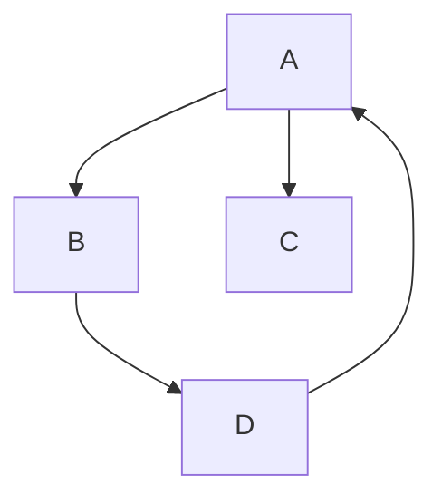
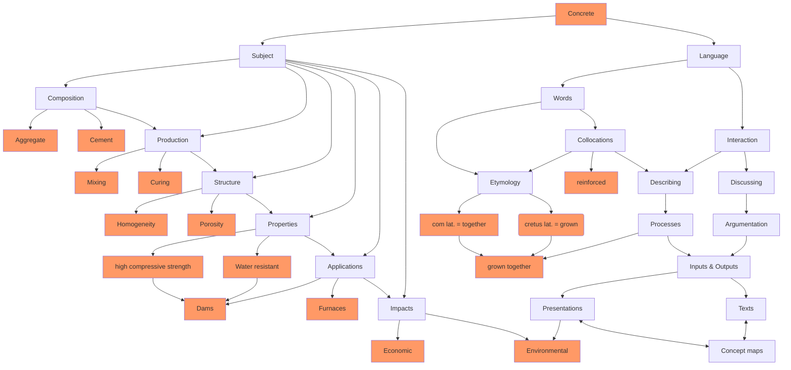

<!--

author: Gregor Große-Bölting
email:  ggb@informatik.uni-kiel.de
version: 0.1
language: en
narrator: UK English Female

@style
.flex-container {

    display: flex;
    flex-wrap: wrap; /* Allows the items to wrap as needed */
    align-items: stretch;
    gap: 20px; /* Adds both horizontal and vertical spacing between items */
}

.flex-child { 
    flex: 1;
    margin-right: 20px; /* Adds space between the columns */
}

@media (max-width: 600px) {
    .flex-child {
        flex: 100%; /* Makes the child divs take up the full width on slim devices */
        margin-right: 0; /* Removes the right margin */
    }
}
@end

import: https://raw.githubusercontent.com/liaScript/mermaid_template/master/README.md

persistent: true

@onload
window.getRandomColor = function() {
  return `rgb(${Math.floor(Math.random() * 256)}, ${Math.floor(Math.random() * 256)}, ${Math.floor(Math.random() * 256)})`
}

window.isSubSet = function(A, B) {
  return [...A].every(element => B.has(element))
}
@end

-->

# LiaScript Workflow-Workshop


 "Foto von <a href="https://unsplash.com/de/@alvarordesign?utm_content=creditCopyText&utm_medium=referral&utm_source=unsplash">Alvaro Reyes</a> auf <a href="https://unsplash.com/de/fotos/person-die-an-bord-an-blauem-und-weissem-papier-arbeitet-qWwpHwip31M?utm_content=creditCopyText&utm_medium=referral&utm_source=unsplash">Unsplash</a>")

## Arbeiten mit LiaScript 

Website <br>
Hilfreiche Links <br>
Infos zu Projekt [LiaBooks](https://github.com/LiaBooks)

## Editieren: VS Code (oder Atom)
Zum Ausprobieren eignet sich der [Web Editor](https://github.dev/). 

Für das lokale Editieren von Markdown-Dateien ist ein *Plain Text*-Editor notwendig, wie bspw. [Visual Studio Code (VS Code)](https://code.visualstudio.com/), das als Open Source-Software entwickelt wird und kostenlos installierbar ist.

### Erste Hinweise zur Navigation in VS Code
[Keyboard shortcuts für Windows](https://code.visualstudio.com/shortcuts/keyboard-shortcuts-windows.pdf) <br>
[Keyboard shortcuts für macOS](https://code.visualstudio.com/shortcuts/keyboard-shortcuts-macos.pdf) <br>
[Keyboard shortcuts für Linux](https://code.visualstudio.com/shortcuts/keyboard-shortcuts-linux.pdf)

### Extensions für VS Code

<section class="flex-container">

<!-- class="flex-child" style="min-width: 250px;" -->
Extensions können in VS Code selbst gesucht und installiert werden:

<!-- class="flex-child" style="min-width: 250px;" -->
1. Extensions-Tab auswählen:
    

<!-- class="flex-child" style="min-width: 250px;" -->
2. Extensions suchen und installieren klicken.
    

<!-- class="flex-child" style="min-width: 250px;" -->
Für VS Code gibt es zwei Extensions, die die Arbeit mit LiaScript deutlich vereinfachen:

* [LiaScript Preview](https://marketplace.visualstudio.com/items?itemName=LiaScript.liascript-preview) bietet eine Vorschau der Markdown-Dokumente als LiaScript-Kurse. 
        Die Vorschau im Development Server kann gestartet werden, indem du in VS Code *Strg* + *Umschalt* + *p* drückst und anschließend *LiaScript Preview ...* eintippst oder einer der folgenden Shortcuts verwendest. Du hast hierbei die Wahl zwischen <br>
        - einem live-Mode, in dem gespeicherte Änderungen (Speicherung via strg-s) automatisch aktualisiert werden: [alt+l]    (auf einem Mac [cmd+l]) und <br>
        - einem manuellen Modus: [alt+shift+l] (auf einem Mac [cmd+shift+l]).
        Der DevServer lässt sich via [alt+l+c] (auf einem Mac [cmd+l+c]) stoppen.

* [LiaScript Snippets](https://marketplace.visualstudio.com/items?itemName=LiaScript.liascript-snippets) stellt verschiedene Markdown-Snippets zur Verfügung und ermöglicht bspw. auch die schnelle Generierung von Tabellen. Nach der Installation der Extension ist eine weitere Konfiguration notwendig: Hierzu einmal die command line öffnen (strg-ctrl-p) und folgenden Code in settings.json eingeben:

```markdown
"[markdown]": {
      "editor.tabCompletion": "on",
      "editor.quickSuggestions": true,
      "editor.snippetSuggestions": "top"
   }
```

</section>

### Projekete verwalten in VS Code
...

## Grundlagen: Markdown

Markdown is intended to be as easy-to-read and easy-to-write as is feasible.

> Readability, however, is emphasized above all else. A Markdown-formatted document should be publishable as-is, as plain text, without looking like it’s been marked up with tags or formatting instructions. While Markdown’s syntax has been influenced by several existing text-to-HTML filters — including Setext, atx, Textile, reStructuredText, Grutatext, and EtText — the single biggest source of inspiration for Markdown’s syntax is the format of plain text email.

To this end, Markdown’s syntax is comprised entirely of punctuation characters, which punctuation characters have been carefully chosen so as to look like what they mean. E.g., asterisks around a word actually look like \*emphasis\*. Markdown lists look like, well, lists. Even blockquotes look like quoted passages of text, assuming you’ve ever used email.

-- https://daringfireball.net/projects/markdown/syntax

### "Standard" Markdown

Der [ursprüngliche Markdown-Standard](https://daringfireball.net/projects/markdown/syntax) umfasst nur wenige Elemente: Überschriften, Aufzählungen, Zitate, Code (Blocks), horizontale Linien, Links, Fett- und Kursivschreibweise, Bilder, sowie die Möglichkeit Syntax-Elemente zu *escapen* (mit einem \\). 

Verschiedene *Anbieter* haben diesen ursprünglichen Standard um eigene Elemente erweitert. Mit am bekanntesten ist vermutlich die [Github-Variante](https://docs.github.com/en/get-started/writing-on-github/getting-started-with-writing-and-formatting-on-github/basic-writing-and-formatting-syntax) von Markdown. 

#### Macros
##### Metadaten
##### Externe Ressourcen laden 
link

script 

import

##### Konfigurationen
#### Struktur
Sections und Subsections

Lokale Untertitel 
---------------
Ebene 1 \---------------

Ebene 2 ==============

Textblöcke
----------

> Um deinen Text in einem Block darzustellen, fügst du vor den Paragraphen ein > ein.
>
>> Es lassen sich sogar Blöcke in Blöcken darstellen.
>
> ... ein erster Schritt zu einer individuellen Gestaltung ;-) 

```markdown
> Um deinen Text in einem Block darzustellen, fügst du vor den Paragraphen ein > ein.
>
>> Es lassen sich sogar Blöcke in Blöcken darstellen.
>
> ... ein erster Schritt zu einer individuellen Gestaltung ;-) 
```

<!-- style="background-color: lightgreen;"-->
>
> Auch die Hintergrundfarbe lässt sich einstellen, indem du folgenden Code vor deinen Textblock setzt:
>
> ```markdown
> <!-- style="background-color: lightgreen;"-->
> ```


#### Text-Formatierung
Schriftarten (Fonts) und -farben
--------------------------------

```markdown
<!-- class = "animated rollIng" style = "animation-delay: 3s; color: green" -->
```
<!-- class = "animated rollIng" style = "animation-delay: 3s; color: green" -->
Ein Beispiel..., das noch verändert werden sollte

Auch der Style einzelner Elemente kann verändert werden, indem der entsprechende Code direkt hinter diese gesetzt wird...


Highlights
----------

Funktionalität von Zeichen "ausschalten" durch Backlash
-------------------------------------------------------


#### Listen 

1. ..

- ...
  
  - ...

    - ...
  
  - ...

2. ..
3. ..


Hier Code einfügen

#### Tabellen

| Überschrift 1 | Überschrift 2 | Überschrift 3 |
| :------------ | :-----------: | ------------: |
| linksbündig   | zentriert     | rechtsbündig  |

Mittels der horizentalen Trennlinien steuerst du die Anordnung der Items...

```markdown
| Überschrift 1 | Überschrift 2 | Überschrift 3 |
| :------------ | :-----------: | ------------: |
| linksbündig   | zentriert     | rechtsbündig  |
```
Noch ein Tipp: Wie bei den Textblöcken, lassen sich durch Eintippen des Codes

```markdown
 <!-- style="background-color: Farbe;"-->
```

vor die Items die Zellen farblich hinterlegen.

>Tabellen sind im ursprünglichen Markdown-Standard nicht vorgesehen und notorisch relativ  anstrengend in Markdown zu erstellen. Es gibt aber hilfreiche Tools, die bei der Erstellung unterstützen, bspw. https://www.tablesgenerator.com/markdown_tables.
>
>Es existiert auch ein [Plugin](https://marketplace.visualstudio.com/items?itemName=TakumiI.markdowntable) für VS-Code, welches das Erstellen von Tabellen in Markdown erleichtert..

Auch weitere Aufgaben lassen sich so automatisieren; häufig ist eine Lösung nur eine Google-Suche weit entfernt...

Äußerst praktisch ist die automatsiche Erkennung deiner Datensätze und eine entsprechende automatische Erstellung von passenden grafischen Darstellungen!

Hier ein Beispiel...


### LiaScript Markdown
LiaScript stellt weitere Markdown-Syntax zur Verfügung, die insbesondere auf die Verwendung im Bereich der Erstellung von OER ausgelegt ist, d.h. bspw. Elemente für Quizze, Multimedia, etc.

Diese *neue* Syntax wird häufig nicht von anderen Markdown-Interpretern unterstüzt und entsprechend falsch, anders oder gar nicht dargestellt.

#### Multimedia einbinden
Links
-----
Einfacher URL-Link

```markdown
[link](URL)
```

Link benennen

QR-Code 

Interner Link zur [nächsten Folie](#18)

Bilder
------

Videos
------

Audio:
------
?[audio](Link)

Audio in Präsentation einbinden
-------------------------------

```markdown
--{{0 Deutsch Female}}-- 
```

--{{0 Deutsch Female}}--
Auf diese Weise kannst du Audioelemente in deine Präsentation einbinden.


Gallerie
--------

 ?[audio](url) !?[movie](url)
??[something else](url)
??[something else](url)

#### Quiz 

Welche Klammern setze ich doppelt um die Lösung eines Quizzes?

  [[eckige]]

Auch Multiple-Choice-Fragen sind möglich:

    [[X]] Ein **X** markiert die korrekte Lösung
    [[ ]] Klammern für falsche Antworten lässt du leer
    [[X]] Es können mehrere Antworten korrekt sein

```markdown
    [[X]] Ein **X** markiert die korrekte Lösung
    [[ ]] Klammern für falsche Antworten lässt du leer
    [[X]] Es können mehrere Antworten korrekt sein
```

Hinweise können über ? eingefügt werden:

...

#### Interaktive Codes
...

#### Templates zur Erweiterung
Kurze Erklärung Macros <br>

[Templates zur Erweiterung](https://github.com/LiaScript/templates)<br>
[weitere Templates](https://github.com/liaTemplates)

##### Digitale Tafel 
https://github.com/LiaTemplates/CollaborativeDrawing

<script run-once="true">
const canvas = document.getElementById("canvas_@0");
const ctx = canvas.getContext("2d");
const color = window.getRandomColor();
const dots = new Set();
let drawing = false;
let lastX = 0;
let lastY = 0;

function publish() {
  if (LIA.classroom.connected) {
    LIA.classroom.publish("dots_@0", JSON.stringify(Array.from(dots)));
  }
}

function getPos(event) {
  const rect = canvas.getBoundingClientRect();
  const scaleX = canvas.width / rect.width;
  const scaleY = canvas.height / rect.height;
  let clientX, clientY;

  if (event.touches) {
    clientX = event.touches[0].clientX;
    clientY = event.touches[0].clientY;
  } else {
    clientX = event.clientX;
    clientY = event.clientY;
  }

  return {
    x: (clientX - rect.left) * scaleX,
    y: (clientY - rect.top) * scaleY
  };
}

function drawLine(x1, y1, x2, y2, color) {
  ctx.beginPath();
  ctx.moveTo(x1, y1);
  ctx.lineTo(x2, y2);
  ctx.strokeStyle = color;
  ctx.lineWidth = 1;
  ctx.stroke();
}

function redrawDots() {
  ctx.clearRect(0, 0, canvas.width, canvas.height);
  dots.forEach(dotString => {
    const dot = JSON.parse(dotString);
    drawLine(dot.lastX, dot.lastY, dot.x, dot.y, dot.color);
  });
}

function startDrawing(event) {
  drawing = true;
  const { x, y } = getPos(event);
  lastX = x;
  lastY = y;
  dots.add(JSON.stringify({ x, y, color }));
  publish();
}

function draw(event) {
  if (!drawing) return;
  const { x, y } = getPos(event);
  dots.add(JSON.stringify({ x, y, lastX, lastY, color }));
  publish();
  drawLine(lastX, lastY, x, y, color);
  lastX = x;
  lastY = y;
  if (event.touches) event.preventDefault(); // Prevent scrolling on touch devices
}

function stopDrawing() {
  drawing = false;
}

canvas.addEventListener('mousedown', startDrawing);
canvas.addEventListener('mousemove', draw);
canvas.addEventListener('mouseup', stopDrawing);
canvas.addEventListener('mouseout', stopDrawing);

canvas.addEventListener('touchstart', startDrawing);
canvas.addEventListener('touchmove', draw);
canvas.addEventListener('touchend', stopDrawing);
canvas.addEventListener('touchcancel', stopDrawing);

LIA.classroom.on("connect", () => {
  setTimeout(() => {
    console.log("connected");
    LIA.classroom.publish("join_@0", null);
  }, 1000);
});

LIA.classroom.subscribe("dots_@0", (message) => {
  const receivedDots = new Set(JSON.parse(message));
  const allDots = new Set([...dots, ...receivedDots]);

  if (!window.isSubSet(dots, receivedDots)) {
    receivedDots.forEach(dot => dots.add(dot));
    publish();
  } else {
    receivedDots.forEach(dot => dots.add(dot));
  }

  redrawDots();
});

LIA.classroom.subscribe("join_@0", publish);

console.log("painting on canvas_@0");
</script>
<canvas
  id="canvas_@0"
  width="@1"
  height="@2"
  style="border: 1px solid black; width: 100%; background: url('@3') center/cover no-repeat;">
</canvas>


##### Grafiken

ASCII-Art
---------
vorläufiges Beispiel..


                                    
    1.9 |    DOTS
        |                 ***
      y |               *     *
      - | r r r r r r r*r r r r*r r r r r r r
      a |             *         *
      x |            *           *
      i | B B B B B * B B B B B B * B B B B B
      s |         *                 *
        | *  * *                       * *  *
     -1 +------------------------------------
        0              x-axis               1

Mermaid Template
----------------
Vorläufiges Beispiel..





---

#### Fußnoten

## Zusammenarbeiten

Hier wird's interessant... 

### CAU Cloud


Niemals (niemals, nie) sollten LiaScript-Markdown Dateien über den Cloud-Editor der CAU Cloud geöffnet werden: Der Editor fügt schon durch das bloße Öffnen unerwünschte Sonderzeichen ein, die die Dokumente (insbesondere Tabellen und Quizze) zerstören. 

Die CAU Cloud bzw. OwnCloud stellt einen Desktop-Client zur Verfügung, der die Dateien und Verzeichnisse auf den lokalen Rechner synchronisiert. Dadurch ist eine gute Zusammenarbeit möglich. Nähere Informationen dazu gibt es hier: https://www.rz.uni-kiel.de/de/angebote/storage/cau-cloud

### git und Github

Noch eine bessere Möglichkeit der Zusammenarbeit bieten das Versionskontrollsystem Git und die darauf aufbauende webbasierte Plattform Github. 

VS Code bietet von Hause aus die Möglichkeit eigene Projekte mit git zu verwalten. Dafür ist die vorherige Installation eines [git Clients](https://git-scm.com/downloads) nötig. 

Für Details ist die VS Code-Hilfe zu dem Thema zu empfehlen: https://code.visualstudio.com/docs/sourcecontrol/overview Daraus ist auch das folgende Video...

<iframe width="560" height="315" src="https://www.youtube.com/embed/i_23KUAEtUM?si=pidcuGkhajN4JEsu" title="YouTube video player" frameborder="0" allow="accelerometer; autoplay; clipboard-write; encrypted-media; gyroscope; picture-in-picture; web-share" referrerpolicy="strict-origin-when-cross-origin" allowfullscreen></iframe>

## Publizieren

Wie kann ich meinen schönen Kurs nun anderen zur Verfügung stellen, bspw. Studierenden? Diese Frage ist derzeit leider noch nicht so einfach zu beantworten.

### LiaScript Webservice

Das ist die einfachste Variante: Sofern das LiaScript-Markdown bei Github liegt, kann man den Dokumentenlink kopieren und auf der LiaScript-Startseite einfügen:


Im Ergebnis erhält man ein *Rendering* des eigenen Kurses, dass dann bspw. mit Studierenden geteilt werden kann.

### CAU Webservice

Es gibt probeweise einen [LiaScript Webservice vom RZ](https://vm077.test.rz.uni-kiel.de/), der nur aus dem Uni-Netz erreichbar ist. Der Service läuft nicht  sehr stabil und wird nicht regelmäßig gewartet.

Es ist möglicherweise nicht klug ihn zu verwenden.


### Statische Website(n)

Mit dem [LiaScript-Exporter](https://github.com/LiaScript/LiaScript-Exporter) ist eine Umwandlung des eigenen LiaScript-Kurses in diverse Ausgabeformate möglich. Die Steuerung erfolgt über die Kommandozeile und erfordert die vorherige Installation von [NodeJS](https://nodejs.org/en/download/).

Der Exporter eröffnet die Möglichkeit eine statische Website zu generieren, die dann über *ganz normalen* Webspace ausgeliefert werden kann. 

## Die Zukunft: LiveEditor

https://liascript.github.io/LiveEditor/