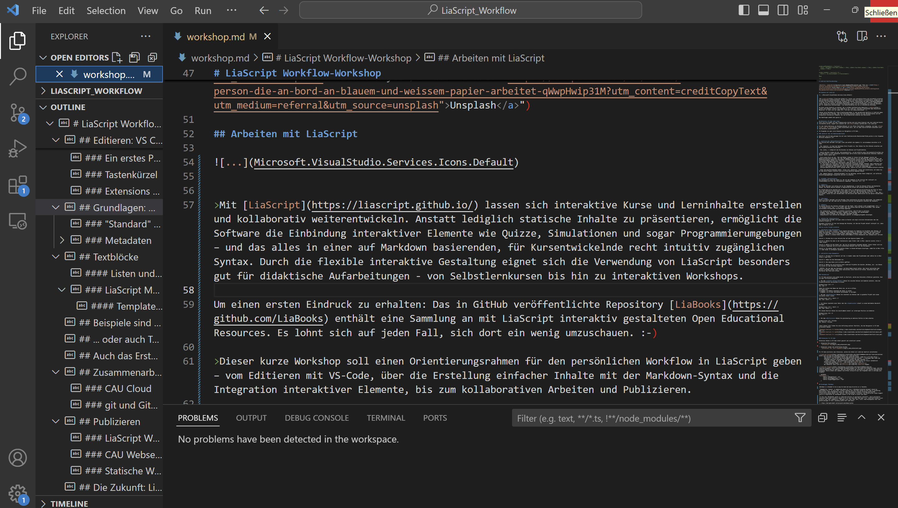
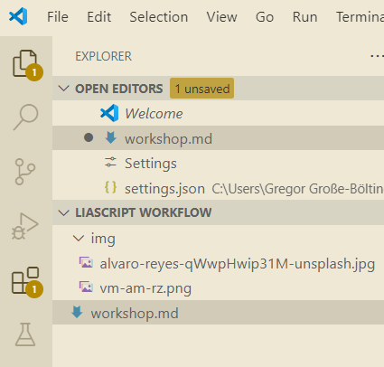
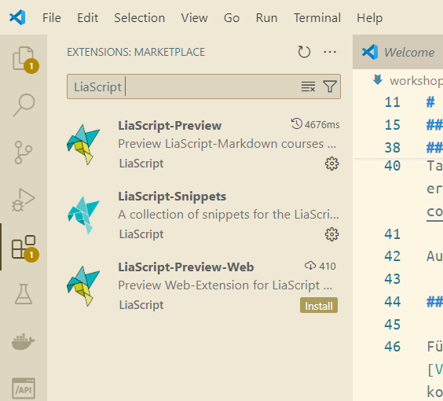
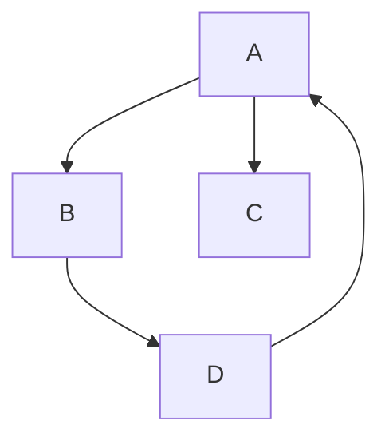
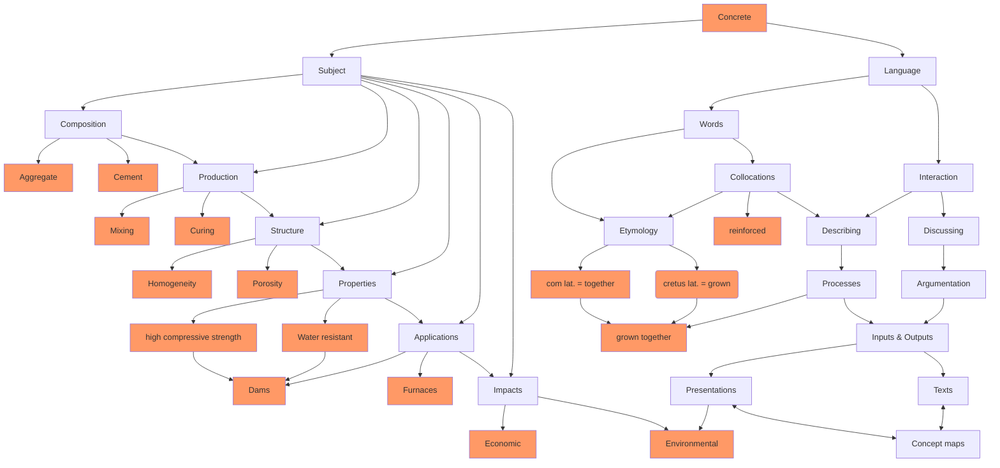
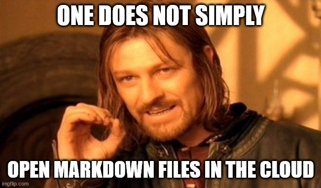
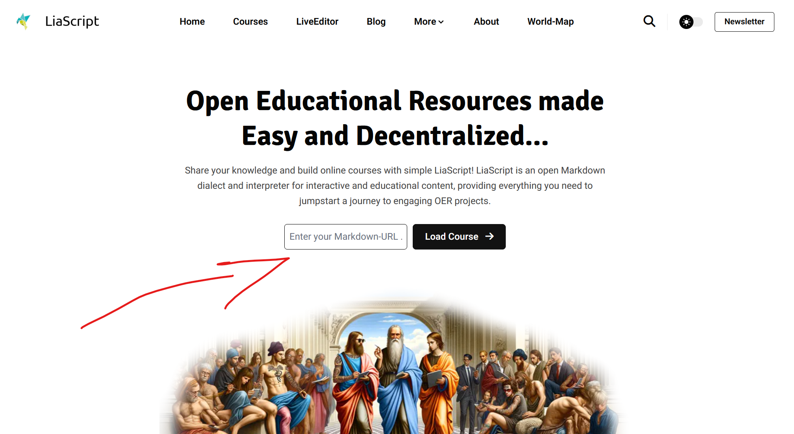

<!--

author: Gregor Große-Bölting
email:  ggb@informatik.uni-kiel.de
version: 0.1
language: en
narrator: UK English Female

@style
.flex-container {

    display: flex;
    flex-wrap: wrap; /* Allows the items to wrap as needed */
    align-items: stretch;
    gap: 20px; /* Adds both horizontal and vertical spacing between items */
}

.flex-child { 
    flex: 1;
    margin-right: 20px; /* Adds space between the columns */
}

@media (max-width: 600px) {
    .flex-child {
        flex: 100%; /* Makes the child divs take up the full width on slim devices */
        margin-right: 0; /* Removes the right margin */
    }
}
@end

import: https://raw.githubusercontent.com/liaScript/mermaid_template/master/README.md

persistent: true

@onload
window.getRandomColor = function() {
  return `rgb(${Math.floor(Math.random() * 256)}, ${Math.floor(Math.random() * 256)}, ${Math.floor(Math.random() * 256)})`
}

window.isSubSet = function(A, B) {
  return [...A].every(element => B.has(element))
}
@end

-->

# LiaScript Workflow-Workshop


## Arbeiten mit LiaScript 

>Mit [LiaScript](https://liascript.github.io/) lassen sich interaktive Kurse und Lerninhalte erstellen und kollaborativ weiterentwickeln. Anstatt lediglich statische Inhalte zu präsentieren, ermöglicht die Software die Einbindung interaktiver Elemente wie Quizze, Simulationen und sogar Programmierumgebungen – und das alles in einer auf Markdown basierenden, für Kursentwickelnde recht intuitiv zugänglichen Syntax. Durch die flexible interaktive Gestaltung eignet sich die Verwendung von LiaScript besonders gut für didaktische Aufarbeitungen - von Selbstlernkursen bis hin zu interaktiven Workshops.

Um einen ersten Eindruck zu erhalten: Das in GitHub veröffentlichte Repository [LiaBooks](https://github.com/LiaBooks) enthält eine Sammlung an mit LiaScript interaktiv gestalteten Open Educational Resources. Es lohnt sich auf jeden Fall, sich dort ein wenig umzuschauen. :-)

>Dieser kurze Workshop soll einen Orientierungsrahmen für den persönlichen Workflow in LiaScript geben – vom Editieren mit VS-Code, über die Erstellung einfacher Inhalte mit der Markdown-Syntax und die Integration interaktiver Elemente, bis zum kollaborativen Arbeiten und Publizieren.

Bei Nachfragen wendet Euch gerne an ...


## Editieren: VS Code (oder Atom)
Falls Sie erst einmal ein paar Probeversuche starten und sich einen Eindruck über die LiaScript-Synatx verschaffen wollen, eignet sich zunächst der [Web Editor](https://github.dev/) von LiaScript.

Für das lokale Editieren von Markdown-Dateien ist ein *Plain Text*-Editor notwendig, wie bspw. [Visual Studio Code (VS Code)](https://code.visualstudio.com/), der als Open Source-Software entwickelt wird und kostenlos installierbar ist.

Im Folgenden ein paar erste Hinweise zur Navigation in VS Code...

### Überblick über die Benutzeroberfläche



Beim Start von VS Code gelangen Sie auf eine funktionsreiche Benutzeroberfläche,welche in die folgenden Bereiche aufgeteilt ist:


1. **activity bar (Aktivitätsleiste)**
Die Activity Bar befindet sich ganz links und enthält die Symbole für verschiedenen Ansichten in VS Code:

- Der _Explorer_ 📁 zeigt den Dateibaum Ihres Projekts an. Hier können Sie Ihre Dateien verwalten und das Projektverzeichnis durchsuchen.

- Die _Suche_ 🔍 ermöglicht das Durchsuchen von Dateien und Projektinhalten.

- Gleich darunter finden Sie die _Versionskontrolle_, wo Sie mithilfe eines Versionskontrollsystems wie GIT Änderungen in Ihren Dokumenten nachverfolgen und im Falle eines kollaborativen Arbeitens committen können. Hierzu später mehr...

- Durch einen Klick auf das _"Run and Debug"_-Symbol ▶️ lassen sich der Debugger starten und Debug-Informationen anzeigen. Die „Run and Debug“-Funktion ist ein Werkzeug zur Ausführung (Run) und Fehlerbeseitugung (Debug) von Programmen. Entwickler*innen erhalten hier die Möglichkeit ihren Code in klassischen Programmiersprachen (Java, C++, ...) direkt in VS Code auszuführen, Fehler zu finden und das Verhalten des Programms zu analysieren, ohne den Editor zu verlassen. 
  Für die Arbeit mit LiaScript sind diese Funktionen allerdings weniger relevant, denn LiaScript wird in einem Webbrowser ausgeführt, der die erstellten interaktiven Inhalte direkt rendert. Sie nutzen hierfür vorrangig den Developement-Server (Dev-Server), in dem die Änderungen als Echtzeit-Website-Vorschau sofort anzeigt werden, wodurch Sie eine schnelle Feedback-Schleife erhalten.

- Unter dem darunterstehenden Symbol, lassen sich _Extensions_ suchen und installieren, mit denen Sie VS Code durch Plugins erweitern und so an Ihren Workflow anpassen können.

- Der _Remote Explorer_ (Bildschirmsymbol) ist ein Werkzeug, welches Ihnen ermöglicht, auf entfernte Entwicklungsumgebungen zuzugreifen und dort zu arbeiten.


2. **Sidebar (Seitenleiste)**
Die Seitenleiste zeigt den Inhalt an, der mit den Symbolen in der Activity Bar verknüpft ist. Standardmäßig wird hier der Dateiexplorer angezeigt. (Shortcut: Ctrl + B)


3. **Editor**
Der Editor befindet sich mittig und ist der Hauptbereich, in dem Sie Dateien öffnen und bearbeiten können. Sie können mehrere Dateien in Registerkarten öffnen und zwischen diesen wechseln. 

Der Breadcrumb-Leiste oberhalb der Datei zeigt Ihnen zur Navigations-Erleichterung den Pfad zur Datei sowie den aktuellen Strukturnamen in der Datei an. Zum Ein- und Ausschalten: Öffnen Sie die Einstellungen (entweder über das Zahnrad-Symbol unten links oder mit dem Shortcut Ctrl + , bzw. Cmd + , auf macOS), suchen Sie nach „Breadcrumbs“ und aktivieren oder deaktivieren Sie die Option „Breadcrumbs: Enable“.


4. **Minimap**
Rechts im Editor befindet sich die Minimap: Eine verkleinerte Vorschau des Quellcodes. Sie ermöglicht eine Übersicht über den Code und ein schnelles Scrollen und Navigieren innerhalb des Dokuments.


5. **Panel**
Im unteren Bereich des Fensters befindet sich das Panel. Falls aktuell nicht eingeblendet: Ctrl + J (für Windows/Linux), Cmd + J (für macOS) oder vom unteren Rand des Editos hochziehen. Hier werden verschiedene Informationen und Werkzeuge angezeigt:

- Ein integriertes _Terminal_, um Befehle auszuführen, ohne VS Code zu verlassen.
- Ausgabe: Zeigt Debug-Informationen, Ausgaben von Programmen und Log-Meldungen.
- Probleme: Zeigt Probleme, wie Fehler oder Warnungen im Code.
- Debug-Konsole: Wird während des Debuggens genutzt, um Debugging-Ausgaben anzuzeigen.


6. **Status Bar (Statusleiste)**
Die Statusleiste befindet sich ganz unten im Fenster und zeigt nützliche Informationen über das aktuelle Projekt an.

Besonders hilfreich ist hier die Anzeige des Branches, mit dem das Projekt aktuell verknüpft ist. (dazu mehr im Kapitel zu Git)

### Ein erstes Projekt erstellen

1. **Erstellen eines Workspaces**
Zunächst ist es immer sinnvoll, einen eigenen Workspace als Sammlung von Projekten oder Dateien, an denen Sie arbeiten, zu erstellen. Indem Sie einen Ordner als Workspace festlegen und diesen öffnen, öffnet VS Code immer alle in diesem Ordner abgelegten Dokumente (inkl. Fotos, Videos oder andere Dateien). Dateien in diesem Ordner können anschließend in Ihren Dokumenten sehr unkompliziert verlinkt werden.

Schritt 1: Klicken Sie in der Activity Bar auf das Explorer-Symbol (📁).

Schritt 2: Wählen Sie oben in der Seitenleiste „open folder“ oder im Menü (oberste Leiste) „file“ → „open folder“.

Schritt 3: Wählen Sie den Ordner aus, den Sie als Workspace verwenden möchten. Dieser Ordner wird nun im Explorer angezeigt und alle darin enthaltenen Dateien sind Teil des Workspaces.

Schritt 4: Sie können später noch weitere Ordner zu diesem Workspace hinzufügen, indem Sie im Menü „file“ → „Add folder to workspace“ auswählen.


2. **Erstellen eines Dokuments**

Schritt 1: Klicken Sie im Explorer auf das „+“-Symbol neben dem Projektnamen oder wählen Sie im Menü „file“ → „new file“.

Schritt 2: Geben Sie den Dateinamen ein.

Schritt 3: Die neue Datei wird im Editor geöffnet.

Schritt 4: Wählen Sie zum Erstellen eines LiaScript Projektes die Sprache _Markdown_ aus - nun können Sie direkt mit dem Schreiben beginnen.

>!WCHTIG!: Bei der Wahl der Workspace- und Datei-Namen darauf achten, dass keine Leerzeichen oder Umlaute verwendet werden! Statt eines Leerzeichens einen Unterstrich nutzen. Ansonsten kann der Dev-Server den Pfad nicht öffnen.


### Tastenkürzel

Für VS Code existiert eine große Anzahl an Shortcuts, welche das Entwickeln effektiver gestalten. Hier ein paar hilfreiche Beispiele:

1. Mit dem **„Schnell öffnen“-Befehl** können Sie zwischen Dateien und Symbolen wechseln, ohne das Projektverzeichnis durchsuchen zu müssen.

Windows/Linux: Ctrl + P
Mac: Cmd + P

Geben Sie einfach den Namen der Datei ein, um sie zu öffnen.
Sie könne auch
@ eingeben, um Symbole innerhalb der Datei zu suchen.
: eingeben, um zu einer bestimmten Zeilennummer zu springen.

2. Mit der **Suchfunktion** können Sie innerhalb von Dateien oder im gesamten Projekt nach einem bestimmten Inhalt suchen.

Windows/Linux: Ctrl + Shift + F
Mac: Cmd + Shift + F


3. Sie können innerhalb einer Datei über die **Symbolsuche** schnell zu einem bestimmten Abschnitt springen.

Windows/Linux: Ctrl + Shift + O
Mac: Cmd + Shift + O

Mit diesem Shortcut können Sie anschließend schnell zur vorherigen Position zurückkehren:

Windows/Linux: Alt + ←
Mac: Ctrl + -


4. Mit dem **Multicursor** können Sie gleichzeitig an mehreren Stellen im Code arbeiten.

Windows/Linux: Alt + Klicken
Mac: Option + Klicken


>Unter diesen Links finden Sie eine Auflistung weiterer ShortCuts, die das Navigieren in VS Code erleichtern können:
>
>[Keyboard shortcuts für Windows](https://code.visualstudio.com/shortcuts/keyboard-shortcuts-windows.pdf) <br>
>[Keyboard shortcuts für macOS](https://code.visualstudio.com/shortcuts/keyboard-shortcuts-macos.pdf) <br>
>[Keyboard shortcuts für Linux](https://code.visualstudio.com/shortcuts/keyboard-shortcuts-linux.pdf)


### Extensions für VS Code

Extensions können in VS Code selbst gesucht und installiert werden:

1. Extensions-Tab auswählen:
    

2. Extensions suchen und installieren klicken.
    


Für VS Code existieren zwei Extensions, welche die Arbeit mit LiaScript deutlich vereinfachen:

* [LiaScript Preview](https://marketplace.visualstudio.com/items?itemName=LiaScript.liascript-preview) bietet eine Vorschau der Markdown-Dokumente als LiaScript-Kurse. 
        Die Vorschau im Development Server kann gestartet werden, indem Sie in VS Code *Strg* + *Umschalt* + *p* drücken und anschließend *LiaScript Preview ...* eintippen oder einer der folgenden Shortcuts verwenden. Sie haben hierbei die Wahl zwischen <br>
        - einem live-Mode, in dem gespeicherte Änderungen (Speicherung via strg-s) automatisch aktualisiert werden: [alt+l]    (auf einem Mac [cmd+l]) und <br>
        - einem manuellen Modus: [alt+shift+l] (auf einem Mac [cmd+shift+l]).
        Der DevServer lässt sich via [alt+l+c] (auf einem Mac [cmd+l+c]) stoppen.

* [LiaScript Snippets](https://marketplace.visualstudio.com/items?itemName=LiaScript.liascript-snippets) stellt verschiedene Markdown-Snippets zur Verfügung und ermöglicht bspw. auch die schnelle Generierung von Tabellen. Nach der Installation der Extension ist eine weitere Konfiguration notwendig: Hierzu einmal die command line öffnen (*strg-ctrl-p*) und folgenden Code in settings.json eingeben:

```markdown
"[markdown]": {
      "editor.tabCompletion": "on",
      "editor.quickSuggestions": true,
      "editor.snippetSuggestions": "top"
   }
```

## Grundlagen: Markdown

>Markdown is intended to be as easy-to-read and easy-to-write as is feasible.
>
> Readability, however, is emphasized above all else. A Markdown-formatted document should be publishable as-is, as plain text, without looking like it’s been marked up with tags or formatting instructions. While Markdown’s syntax has been influenced by several existing text-to-HTML filters — including Setext, atx, Textile, reStructuredText, Grutatext, and EtText — the single biggest source of inspiration for Markdown’s syntax is the format of plain text email.
>
>To this end, Markdown’s syntax is comprised entirely of punctuation characters, which punctuation characters have been carefully chosen so as to look like what they mean. E.g., asterisks around a word actually look like \*emphasis\*. Markdown lists look like, well, lists. Even blockquotes look like quoted passages of text, assuming you’ve ever used email.
>
>-- https://daringfireball.net/projects/markdown/syntax

### "Standard" Markdown

Der [ursprüngliche Markdown-Standard](https://daringfireball.net/projects/markdown/syntax) umfasst nur wenige Elemente: Überschriften, Aufzählungen, Zitate, Code (Blocks), horizontale Linien, Links, Fett- und Kursivschreibweise, Bilder, sowie die Möglichkeit Syntax-Elemente zu *escapen* (mit einem \\). 

Verschiedene *Anbieter* haben diesen ursprünglichen Standard um eigene Elemente erweitert. Mit am bekanntesten ist vermutlich die [Github-Variante](https://docs.github.com/en/get-started/writing-on-github/getting-started-with-writing-and-formatting-on-github/basic-writing-and-formatting-syntax) von Markdown. 

>Unter den aufgeführten Links können Sie sich einen ersten Überblick über die Markdown-Syntax verschaffen. Ein paar wenige, wichtige Syntax-Elemente werden im Folgenden kurz aufgeführt, um den Einstieg zu erleichtern...

### Metadaten
Metadaten sind Informationen über das Dokument, die auf dem Hauptteil der Website später nicht sichtbar, aber wichtig für die Verarbeitung und Darstellung des Dokuments sind. In LiaScript werden sie typischerweise am Anfang der Markdown-Datei definiert.

Beispiel:

```markdown
<!--
author: beispielname
email:  beispielname@mail.de
version: 0.1
language: en
narrator: UK English Female
-->
```
#### Macros
 Makros spielen eine zentrale Rolle, um interaktive Inhalte und benutzerdefinierte Funktionen zu erstellen. Sie ermöglichen es, eine Gruppe von Befehlen oder Anweisungen zusammenzufassen, um sie als eine Einheit auszuführen.

**Externe Ressourcen laden**
LiaScript ermöglicht es, externe Ressourcen wie CSS-Dateien, JavaScript-Bibliotheken oder andere Skripte zu laden, um die Funktionalität oder das Styling des Dokuments zu erweitern.

Beispiel:

```markdown
<script src="https://example.com/some-script.js"></script>
<link rel="stylesheet" href="https://example.com/styles.css">
```

**Import**
In LiaScript lassen sich Module oder Skripte importieren, um die Wiederverwendbarkeit des Codes zu fördern. Dies ist nützlich, wenn Sie komplexe Skripte in mehreren Dokumenten verwenden möchten.

Verwenden Sie hierzu import-Anweisung..

Beispiel:

```markdown
<script type="module">
    import { myFunction } from './myModule.js';
</script>
```

#### Struktur
Ihre Website können Sie durch Verwendung von Hashtags in Sections (#) und Subsections (mehrere #) organisieren:

```markdown
# Dies ist eine Section 
## Dies ist eine Subsection 
### Dies ist eine Sub-Subsection 
...
```

Lokale Untertitel innerhalb einer Section lassen sich durch das Einfügen von mindestens drei Gleichheitszeichen oder Bindestrichen in der Zeile unter dem Untertitel konfigurieren:

Dies ist ein Untertitel
-----------------------

```markdown 
Dies ist ein Untertitel
-----------------------
```

Textblöcke
----------

> Um Ihren Text in einem Block darzustellen, fügen Sie vor dem Paragraphen ein > ein.
>
>> Es lassen sich sogar Blöcke in Blöcken darstellen.
>
> ... ein erster Schritt zu einer individuellen Gestaltung ;-) 

```markdown
> Um Ihren Text in einem Block darzustellen, fügen Sie vor den Paragraphen ein > ein.
>
>> Es lassen sich sogar Blöcke in Blöcken darstellen.
>
> ... ein erster Schritt zu einer individuellen Gestaltung ;-) 
```

<!-- style="background-color: lightgreen;"-->
>
> Auch die Hintergrundfarbe lässt sich einstellen, indem Sie folgenden HTML-Kommentar vor den Textblock setzen:
>
> ```markdown
> <!-- style="background-color: lightgreen;"-->
> ```


#### Listen und Tabellen

1. Nummerierte Listen und 

- unnummerierte Listen lassen sich sehr intuitiv erstellen.
  
  - Einrücken, um eine neue Listenebene zu eröffnen..

    - ...
  
  - ...

2. ..
3. ..


```Markdown
1. Nummerierte Listen und 

- unnummerierte Listen lassen sich sehr intuitiv erstellen.
  
  - Einrücken, um eine neue Listenebene zu eröffnen..

    - ...
  
  - ...

2. ..
3. ..
```

**Tabellen** erstellen Sie wie folgt:

| Überschrift 1 | Überschrift 2 | Überschrift 3 |
| :------------ | :-----------: | ------------: |
| linksbündig   | zentriert     | rechtsbündig  |

Mittels der horizentalen Trennlinien steuern Sie die Anordnung der Items...

```markdown
| Überschrift 1 | Überschrift 2 | Überschrift 3 |
| :------------ | :-----------: | ------------: |
| linksbündig   | zentriert     | rechtsbündig  |
```

Noch ein Tipp: Wie bei den Textblöcken, lassen sich durch Eintippen des Codes

```markdown
 <!-- style="background-color: Farbe;"-->
```

vor die Items die Zellen farblich hinterlegen.

>Tabellen sind im ursprünglichen Markdown-Standard nicht vorgesehen und notorisch relativ  anstrengend in Markdown zu erstellen. Es gibt aber hilfreiche Tools, die bei der Erstellung unterstützen, bspw. https://www.tablesgenerator.com/markdown_tables.
>
>Es existiert auch ein [Plugin](https://marketplace.visualstudio.com/items?itemName=TakumiI.markdowntable) für VS-Code, welches das Erstellen von Tabellen in Markdown erleichtert..

Auch weitere Aufgaben lassen sich so automatisieren; häufig ist eine Lösung nur eine Google-Suche weit entfernt...

Äußerst praktisch ist die automatsiche Erkennung Ihrer Datensätze und eine entsprechende automatische Erstellung von passenden grafischen Darstellungen!


### LiaScript Markdown

LiaScript stellt weitere Markdown-Syntax zur Verfügung, die insbesondere auf die Verwendung im Bereich der Erstellung von OER ausgelegt ist, d.h. bspw. Elemente für Quizze, Multimedia, etc.

Diese *neue* Syntax wird häufig nicht von anderen Markdown-Interpretern unterstüzt und entsprechend falsch, anders oder gar nicht dargestellt.

Ein auf GitHub bereitgestelltes [Cheet-Sheet](https://liascript.github.io/blog/liascript-cheet-sheet/#:~:text=LiaScript%20erlaubt%20das%20impotieren%20und%20die%20Nutzung%20von) gibt einen Überblick über die wichtigsten Syntax-Elemente. 

**Hier ein kleines Quiz als Beispiel:**

Welche Klammern setze ich doppelt um die Lösung eines Quizzes?

  [[Eckklammern]]

Auch Multiple-Choice-Fragen sind möglich:

    [[X]] Ein **X** markiert die korrekte Lösung
    [[ ]] Klammern für falsche Antworten lassen Sie leer
    [[X]] Es können mehrere Antworten korrekt sein

```markdown
    [[X]] Ein **X** markiert die korrekte Lösung
    [[ ]] Klammern für falsche Antworten lasse Sie leer
    [[X]] Es können mehrere Antworten korrekt sein
```


#### Templates zur Erweiterung

>Gerade für den Einstieg, aber auch generell zur Beschleunigung des Entwicklungsprozesses, eignet sich das Einbinden von vorgefertigter Strukturen - sogenannter Templates. Auf GitHub sind hiervon bereits viele öffentlich verfügbar: https://github.com/LiaScript/templates oder https://github.com/liaTemplates.

Beispiele sind die Digitale Tafel:
---------------------------------

https://github.com/LiaTemplates/CollaborativeDrawing

<script run-once="true">
const canvas = document.getElementById("canvas_@0");
const ctx = canvas.getContext("2d");
const color = window.getRandomColor();
const dots = new Set();
let drawing = false;
let lastX = 0;
let lastY = 0;

function publish() {
  if (LIA.classroom.connected) {
    LIA.classroom.publish("dots_@0", JSON.stringify(Array.from(dots)));
  }
}

function getPos(event) {
  const rect = canvas.getBoundingClientRect();
  const scaleX = canvas.width / rect.width;
  const scaleY = canvas.height / rect.height;
  let clientX, clientY;

  if (event.touches) {
    clientX = event.touches[0].clientX;
    clientY = event.touches[0].clientY;
  } else {
    clientX = event.clientX;
    clientY = event.clientY;
  }

  return {
    x: (clientX - rect.left) * scaleX,
    y: (clientY - rect.top) * scaleY
  };
}

function drawLine(x1, y1, x2, y2, color) {
  ctx.beginPath();
  ctx.moveTo(x1, y1);
  ctx.lineTo(x2, y2);
  ctx.strokeStyle = color;
  ctx.lineWidth = 1;
  ctx.stroke();
}

function redrawDots() {
  ctx.clearRect(0, 0, canvas.width, canvas.height);
  dots.forEach(dotString => {
    const dot = JSON.parse(dotString);
    drawLine(dot.lastX, dot.lastY, dot.x, dot.y, dot.color);
  });
}

function startDrawing(event) {
  drawing = true;
  const { x, y } = getPos(event);
  lastX = x;
  lastY = y;
  dots.add(JSON.stringify({ x, y, color }));
  publish();
}

function draw(event) {
  if (!drawing) return;
  const { x, y } = getPos(event);
  dots.add(JSON.stringify({ x, y, lastX, lastY, color }));
  publish();
  drawLine(lastX, lastY, x, y, color);
  lastX = x;
  lastY = y;
  if (event.touches) event.preventDefault(); // Prevent scrolling on touch devices
}

function stopDrawing() {
  drawing = false;
}

canvas.addEventListener('mousedown', startDrawing);
canvas.addEventListener('mousemove', draw);
canvas.addEventListener('mouseup', stopDrawing);
canvas.addEventListener('mouseout', stopDrawing);

canvas.addEventListener('touchstart', startDrawing);
canvas.addEventListener('touchmove', draw);
canvas.addEventListener('touchend', stopDrawing);
canvas.addEventListener('touchcancel', stopDrawing);

LIA.classroom.on("connect", () => {
  setTimeout(() => {
    console.log("connected");
    LIA.classroom.publish("join_@0", null);
  }, 1000);
});

LIA.classroom.subscribe("dots_@0", (message) => {
  const receivedDots = new Set(JSON.parse(message));
  const allDots = new Set([...dots, ...receivedDots]);

  if (!window.isSubSet(dots, receivedDots)) {
    receivedDots.forEach(dot => dots.add(dot));
    publish();
  } else {
    receivedDots.forEach(dot => dots.add(dot));
  }

  redrawDots();
});

LIA.classroom.subscribe("join_@0", publish);

console.log("painting on canvas_@0");
</script>
<canvas
  id="canvas_@0"
  width="@1"
  height="@2"
  style="border: 1px solid black; width: 100%; background: url('@3') center/cover no-repeat;">
</canvas>


... oder auch Templates zur Erstellung von Grafiken via ASCII-Art
-----------------------------------------------------------------


                                    
    1.9 |    DOTS
        |                 ***
      y |               *     *
      - | r r r r r r r*r r r r*r r r r r r r
      a |             *         *
      x |            *           *
      i | B B B B B * B B B B B B * B B B B B
      s |         *                 *
        | *  * *                       * *  *
     -1 +------------------------------------
        0              x-axis               1


Auch das Erstellen von Diagrammen via Mermaid Template ist möglich:
-------------------------------------------------------------------
https://github.com/LiaTemplates/mermaid_template





## Zusammenarbeiten

Hier wird's besonders interessant..

### CAU Cloud



Niemals (niemals, nie) sollten LiaScript-Markdown Dateien über den Cloud-Editor der CAU Cloud geöffnet werden: Der Editor fügt schon durch das bloße Öffnen unerwünschte Sonderzeichen ein, die die Dokumente (insbesondere Tabellen und Quizze) zerstören. 

Die CAU Cloud bzw. OwnCloud stellt einen Desktop-Client zur Verfügung, der die Dateien und Verzeichnisse auf den lokalen Rechner synchronisiert. Dadurch ist eine gute Zusammenarbeit möglich. Nähere Informationen dazu gibt es hier: https://www.rz.uni-kiel.de/de/angebote/storage/cau-cloud

### git und Github

Noch eine bessere Möglichkeit der Zusammenarbeit bieten das Versionskontrollsystem Git und die darauf aufbauende webbasierte Plattform Github. 

VS Code bietet die Möglichkeit, eigene Projekte mit Git zu verwalten. Dafür ist die vorherige Installation eines [git Clients](https://git-scm.com/downloads) nötig. 

Hinweis: Bei der Installation sind die vorab ausgewählten Einstellungen die gängigsten und können, falls keine individuellen Wünsche bestehen, zunächst erst einmal so belassen werden. Sinnvoll (aber nicht notwendig) ist allerdings die Änderung des Branch-Namens auf den aktuellen Standard "main". Branches können aber auch später noch umbenannt, neu erstellt und verwaltet werden. 

Änderungen in Ihrem Projekt können Sie anschließend in einem ausgewählten Repository in GitHub pushen, indem Sie Ihr Dokument mit einem Remote verknüpfen und dann den aktuellen Branch hochladen. 

Hierzu sollten Sie sich zunächst erst einmal ein Konto auf [GitHub](https://github.com) erstellen.

Für Details im Umgang mit GitHub ist die VS Code-Hilfe zu dem Thema zu empfehlen: https://code.visualstudio.com/docs/sourcecontrol/overview.

Daraus ist auch das folgende Video...

<iframe width="560" height="315" src="https://www.youtube.com/embed/i_23KUAEtUM?si=pidcuGkhajN4JEsu" title="YouTube video player" frameborder="0" allow="accelerometer; autoplay; clipboard-write; encrypted-media; gyroscope; picture-in-picture; web-share" referrerpolicy="strict-origin-when-cross-origin" allowfullscreen></iframe>

## Publizieren

Wie kann ich meinen schönen Kurs nun anderen zur Verfügung stellen, bspw. Studierenden? Diese Frage ist derzeit leider noch nicht so einfach zu beantworten.

### LiaScript Webservice

**Das ist die einfachste Variante:** Sofern das LiaScript-Markdown bei Github liegt, kann man den Dokumentenlink kopieren und auf der LiaScript-Startseite einfügen.



Im Ergebnis erhält man ein *Rendering* des eigenen Kurses, dass dann bspw. mit Studierenden geteilt werden kann.

### CAU Webservice

Es gibt probeweise einen [LiaScript Webservice vom RZ](https://vm077.test.rz.uni-kiel.de/), der nur aus dem Uni-Netz erreichbar ist. Der Service läuft nicht  sehr stabil und wird nicht regelmäßig gewartet.

...Es ist entsprechend nicht unbedingt sinnvoll, diesen zu verwenden.


### Statische Website(n)

Mit dem [LiaScript-Exporter](https://github.com/LiaScript/LiaScript-Exporter) ist eine Umwandlung des eigenen LiaScript-Kurses in diverse Ausgabeformate möglich. Die Steuerung erfolgt über die Kommandozeile und erfordert die vorherige Installation von [NodeJS](https://nodejs.org/en/download/).

Der Exporter eröffnet die Möglichkeit eine statische Website zu generieren, die dann über *ganz normalen* Webspace ausgeliefert werden kann. 

## Die Zukunft: LiveEditor

https://liascript.github.io/LiveEditor/